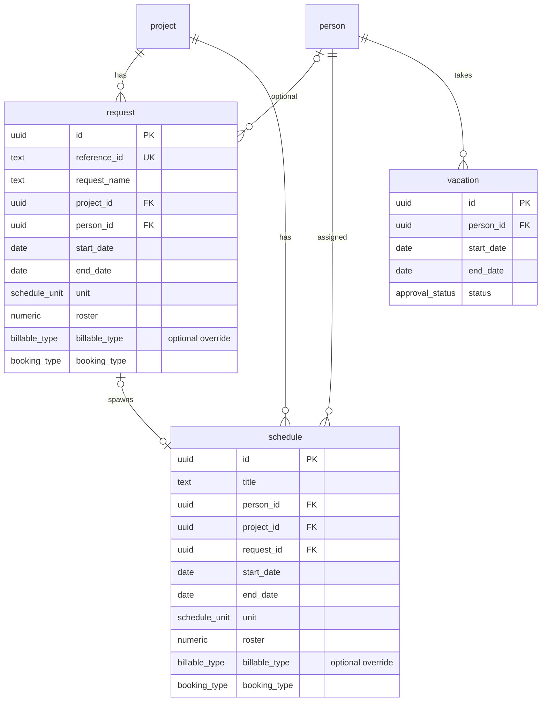

# Clairvoyance Entity Model

Single-tenant data model for **date-range + weekly roster** resource scheduling. All application tables live in the PostgreSQL **`public`** schema and are managed by Flyway migrations in [`thirdparty/flyway/migrations/`](../thirdparty/flyway/migrations/).

## Overview

| Type | Entities |
|------|----------|
| **Master lookup** | `market_unit`, `consulting_unit`, `practice_area`, `competency_center`, `site`, `job_level` |
| **Master** | `project`, `person`, `project_filter`, `person_filter`, `request_filter` |
| **Transactional** | `request`, `schedule`, `vacation`, `simulation_log`, `schedule_audit_log` |

Each `schedule` / `request` row is a first-class **block**: `start_date` / `end_date`, `unit` (`utilization` \| `hours`), and a length-7 `roster` (Mon→Sun). Multiple blocks for the **same person + project may overlap** in date range; the UI stacks them as separate lanes under that person/project. Daily hour totals sum across all overlapping schedules on a person (any project). No capacity hard-limit.

## UI mapping

| Database entity | UI type (`ui/src/types.ts`) | Description |
|-----------------|----------------------------|-------------|
| `project` | `Project` | Project master catalog |
| `person` | `Resource` | People / resource master catalog |
| `schedule` | `ScheduleAssignment` / `AllocationBlock` | Committed allocation block |
| `request` | `BookingRequest` | Pending booking block |
| `vacation` | `Vacation` | Person absence (date-range) |
| `*_filter` | `SavedFilter` | Saved sidebar filter criteria |

## Entity relationship diagram



## Enumerations

| Type | Values |
|------|--------|
| `billable_type` | `Billable`, `Non-billable`, `Opportunity` |
| `booking_type` | `hard`, `soft` |
| `approval_status` | `Pending`, `Approved`, `Rejected` |
| `schedule_unit` | `utilization`, `hours` |

## Schedule / request block shape

```json
{
  "title": "Discovery",
  "start": "2026-03-02",
  "end": "2026-04-17",
  "resourceId": "<person uuid>",
  "projectId": "<project uuid>",
  "unit": "utilization",
  "roster": [1, 1, 1, 1, 1, 0, 0],
  "billableType": "Billable",
  "bookingType": "hard"
}
```

- `roster[0]` = Monday … `roster[6]` = Sunday
- `unit: "utilization"` — fraction of daily capacity (`1` = full day)
- `unit: "hours"` — hours that weekday
- Partial ranges only apply weekdays that fall inside `[start, end]`
- `billableType` on schedule/request is an **optional override**. When omitted/`null`, the project's `billable_type` is used. When present, the override wins.

### Daily hours expansion

For each calendar day `d` in the block:

1. `i = ISO weekday of d` (Mon=0 … Sun=6)
2. If `hours` → contribute `roster[i]`
3. If `utilization` → contribute `roster[i] * (weekly_hours / 5) * fte`

Resource-day total = sum across all overlapping schedules on that person (any project). No capacity enforcement yet. Overlapping bars for the same person+project render as stacked lanes.

## Key RPCs

| Function | Purpose |
|----------|---------|
| `upsert_schedule(payload jsonb)` | Insert/update a schedule block |
| `assert_schedule_no_person_project_overlap(...)` | No-op (overlaps allowed; kept for compatibility) |
| `replace_schedule_range(payload jsonb)` | Carve a sub-range into up to 3 adjacent blocks |
| `split_schedule(payload jsonb)` | Split one block at a date into head + tail |
| `move_schedule(payload jsonb)` | Drag-drop move: entire block or carved sub-range to new person/dates |
| `copy_request_to_schedule(request_id, person_id)` | Approve request → schedule |
| `publish_lab_requests(type, payload)` | Upsert requests with start/end/unit/roster |
| `publish_lab_projects(type, payload)` | Upsert opportunity projects |
| `person_period_utilization(person_id, from, to)` | Daily hours/utilization series |
| `person_utilization_search(...)` | Filter people by availability |
| `schedule_audit_report(...)` | Audit trail export |

## Migrations

Greenfield sequence under `thirdparty/flyway/migrations/` (`V1`–`V15`). Reset with:

```bash
cd thirdparty && docker compose down -v && docker compose up -d
cd flyway && ./migrate.sh dev
```
