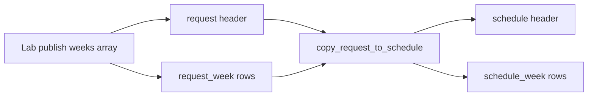

# Clairvoyance Entity Model

Single-tenant data model for **ISO week-based** resource scheduling. All application tables live in the PostgreSQL **`public`** schema and are managed by Flyway migrations in [`thirdparty/flyway/migrations/`](../thirdparty/flyway/migrations/).

Design reference: [`docs/range_to_week_migration_plan.md`](range_to_week_migration_plan.md).

## Overview

| Type | Entities |
|------|----------|
| **Master lookup** | `market_unit`, `consulting_unit`, `practice_area`, `competency_center`, `site` |
| **Master** | `project`, `person`, `project_filter`, `person_filter`, `request_filter` |
| **Calendar** | `calendar_week` |
| **Transactional headers** | `request`, `schedule`, `vacation`, `simulation_log` |
| **Transactional weeks** | `request_week`, `schedule_week` |

Scheduling numbers (`days_per_week`) live only on week rows. Headers carry metadata (`billable_type`, `booking_type`, staffing hints). The UI derives contiguous timeline **blocks** client-side by grouping consecutive weeks with the same `days_per_week`.

## UI mapping

| Database entity | UI type (`ui/src/types.ts`) | Description |
|-----------------|----------------------------|-------------|
| `project` | `Project` | Project master catalog |
| `person` | `Resource` | People / resource master catalog |
| `schedule` + `schedule_week` | `ScheduleAssignment` | Committed assignment header + week rows |
| derived | `AllocationBlock` | Contiguous week span for timeline display |
| `request` + `request_week` | `BookingRequest` | Pending booking header + week rows |
| `vacation` | `Vacation` | Person absence (date-range; unchanged) |
| `*_filter` | `SavedFilter` | Saved sidebar filter criteria |

## Entity relationship diagram

```mermaid
erDiagram
    calendar_week ||--o{ request_week : bounds
    calendar_week ||--o{ schedule_week : bounds
    request ||--o{ request_week : has
    schedule ||--o{ schedule_week : has
    request |o--o| schedule : spawns
    project ||--o{ request : has
    project ||--o{ schedule : has
    person |o--o{ request : optional_assignee
    person ||--o{ schedule : assigned_to
    person ||--o{ vacation : takes

    calendar_week {
        smallint iso_year PK
        smallint iso_week PK
        date week_start
        date week_end
    }

    request {
        uuid id PK
        text reference_id UK
        uuid project_id FK
        uuid person_id FK_nullable
        billable_type billable_type
        booking_type booking_type
        smallint probability
        approval_status status
    }

    request_week {
        uuid id PK
        uuid request_id FK
        smallint iso_year
        smallint iso_week
        smallint days_per_week
    }

    schedule {
        uuid id PK
        uuid project_id FK
        uuid person_id FK
        uuid request_id FK_nullable
        billable_type billable_type
        booking_type booking_type
    }

    schedule_week {
        uuid id PK
        uuid schedule_id FK
        uuid person_id FK
        uuid project_id FK
        smallint iso_year
        smallint iso_week
        smallint days_per_week
    }

    vacation {
        uuid id PK
        uuid person_id FK
        date start_date
        date end_date
        approval_status status
    }
```

## Enumerations

### `billable_type`

Used by `request` and `schedule` headers.

| Value | UI equivalent |
|-------|---------------|
| `Billable` | `BillableType.Billable` |
| `Opportunity` | `BillableType.Opportunity` |

### `booking_type`

Used by `request` and `schedule` headers.

| Value | Meaning |
|-------|---------|
| `hard` | Committed booking |
| `soft` | Tentative / opportunity booking |

### `approval_status`

Used by `request` and `vacation`.

| Value | UI equivalent |
|-------|---------------|
| `Pending` | `'Pending'` |
| `Approved` | `'Approved'` |
| `Rejected` | `'Rejected'` |

## `calendar_week`

ISO 8601 week lookup table (Monday start). Seeded 2020–2035.

| Column | Type | Notes |
|--------|------|-------|
| `iso_year` | SMALLINT | PK (with `iso_week`) |
| `iso_week` | SMALLINT | PK (with `iso_year`) |
| `week_start` | DATE | Monday |
| `week_end` | DATE | Sunday |

Used by RPCs to map date ranges ↔ week rows and for utilization overlap.

## `request` (header)

Pending or approved booking requests. **No date or percent columns.**

| Column | Type | Notes |
|--------|------|-------|
| `id` | UUID | PK |
| `reference_id` | TEXT | UNIQUE; Lab upsert key |
| `project_id` | UUID | FK → `project.id` |
| `person_id` | UUID | FK → `person.id`, nullable |
| `billable_type` | `billable_type` | |
| `booking_type` | `booking_type` | default `hard` |
| `probability` | SMALLINT | 0–100 |
| `status` | `approval_status` | default `Pending` |
| `required_skill` | TEXT | Skill Matcher hint |
| `notes` | TEXT | |
| `consulting_unit_id` | UUID | FK → `consulting_unit.id`, nullable |
| `practice_area_id` | UUID | FK → `practice_area.id`, nullable |
| `competency_center_id` | UUID | FK → `competency_center.id`, nullable |
| `site_id` | UUID | FK → `site.id`, nullable |
| `job_level_id` | UUID | FK → `job_level.id`, nullable |

### `request_week`

| Column | Type | Notes |
|--------|------|-------|
| `request_id` | UUID | FK → `request.id` ON DELETE CASCADE |
| `iso_year` | SMALLINT | |
| `iso_week` | SMALLINT | |
| `days_per_week` | SMALLINT | 0–5 per assignment per week |

UNIQUE (`request_id`, `iso_year`, `iso_week`).

## `schedule` (header)

One row per person–project assignment. **No date or percent columns.**

| Column | Type | Notes |
|--------|------|-------|
| `id` | UUID | PK |
| `project_id` | UUID | FK → `project.id` |
| `person_id` | UUID | FK → `person.id` |
| `request_id` | UUID | FK → `request.id`, nullable |
| `billable_type` | `billable_type` | |
| `booking_type` | `booking_type` | |

### `schedule_week`

| Column | Type | Notes |
|--------|------|-------|
| `schedule_id` | UUID | FK → `schedule.id` ON DELETE CASCADE |
| `person_id` | UUID | Denormalized for queries |
| `project_id` | UUID | Denormalized for queries |
| `iso_year` | SMALLINT | |
| `iso_week` | SMALLINT | |
| `days_per_week` | SMALLINT | 0–5 per assignment per week |

UNIQUE (`person_id`, `project_id`, `iso_year`, `iso_week`) — a person may exceed 5 total days/week across projects, but not per assignment per week.

## Utilization

View `person_period_utilization` and RPC `person_utilization_search(p_from, p_to, p_availability, p_required_days, …)` sum `days_per_week` per ISO week:

- `allocated_days` = sum of `schedule_week.days_per_week` for overlapping weeks
- `available_days` = `5 - allocated_days` (can go negative → over-allocation)

Skill Matcher passes `p_required_days` from the request's peak `days_per_week`.

## Lab publish

`publish_lab_requests` requires each payload item to include a `weeks[]` array:

```json
{
  "id": "upstream-ref-uuid",
  "project_id": "...",
  "billable_type": "Opportunity",
  "booking_type": "soft",
  "weeks": [
    { "iso_year": 2026, "iso_week": 24, "days_per_week": 5 }
  ]
}
```

`start_date`, `end_date`, and `billable_percent` are **rejected**. Upsert replaces all `request_week` rows for the header.

## Schedule RPCs

| RPC | Purpose |
|-----|---------|
| `upsert_schedule_range` | Date range → `calendar_week` → create/update header + week rows |
| `upsert_schedule_weeks` | Patch week rows on an existing schedule |
| `delete_schedule_weeks_in_range` | Remove week rows overlapping a date range |
| `copy_request_to_schedule` | Approve: copy header + `request_week` → `schedule` + `schedule_week` |

## `vacation` (transactional)

Date-range model unchanged.

| Column | Type | Notes |
|--------|------|-------|
| `person_id` | UUID | FK → `person.id` |
| `start_date` | DATE | |
| `end_date` | DATE | ≥ `start_date` |
| `status` | `approval_status` | |

## `person` (master)

People / resource catalog.

| Column | Type | Notes |
|--------|------|-------|
| `id` | UUID | PK |
| `employee_id` | TEXT | UNIQUE |
| `first_name` | TEXT | |
| `last_name` | TEXT | |
| `email` | TEXT | UNIQUE |
| `start_date` | DATE | Optional |
| `gender` | TEXT | Optional |
| `status` | TEXT | Default `'Active'`; CHECK `'Active' \| 'Inactive'` |
| `consulting_unit_id` | UUID | FK → `consulting_unit.id`, nullable |
| `practice_area_id` | UUID | FK → `practice_area.id`, nullable |
| `competency_center_id` | UUID | FK → `competency_center.id`, nullable |
| `lifecycle_status` | TEXT | Default `'Employed'`; CHECK `'Hired' \| 'Employed' \| 'Terminated' \| 'Garden Leave' \| 'Leave' \| 'Parental Leave'` |
| `site_id` | UUID | FK → `site.id`, nullable |
| `employment_type` | TEXT | Optional |
| `job_level_id` | UUID | FK → `job_level.id`, nullable |
| `manager_id` | UUID | FK → `person.id`, nullable (self-referential) |
| `termination_date` | DATE | Optional |
| `fte` | NUMERIC(4,2) | Full-time equivalent; ≥ 0 |
| `weekly_hours` | NUMERIC(5,2) | Optional |
| `global_designation` | TEXT | Optional |
| `local_designation` | TEXT | Optional |
| `created_at` | TIMESTAMPTZ | DEFAULT NOW() |
| `updated_at` | TIMESTAMPTZ | DEFAULT NOW() |

## Lifecycle



1. Upstream/Lab publishes `{ header, weeks[] }` → `request` + `request_week`.
2. Approval calls `copy_request_to_schedule` → one `schedule` header + copied `schedule_week` rows.
3. UI accepts date ranges in modals, materializes to week rows via `dateRangeToWeeks`.
4. Timeline renders derived `AllocationBlock` spans (not stored).

## Access

| Consumer | How | Example |
|----------|-----|---------|
| UI | PostgREST | `GET /schedule?select=*,schedule_week(*)` |
| UI | RPC | `POST /rpc/upsert_schedule_range` |
| Node API | `pg` pool | Direct SQL |

Schema source of truth: Flyway migrations in [`thirdparty/flyway/migrations/`](../thirdparty/flyway/migrations/).

## Fresh database bootstrap

```bash
cd thirdparty
docker compose down -v
docker compose up -d
cd flyway && ./migrate.sh dev
```
